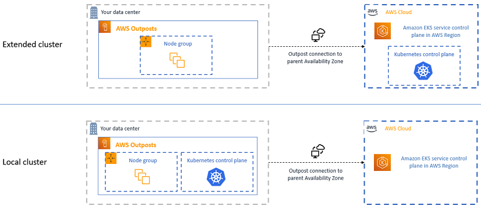
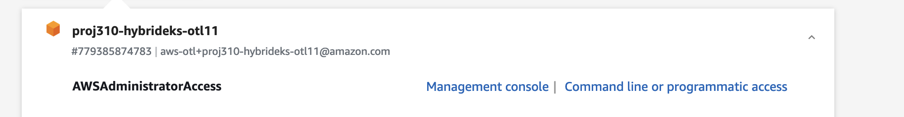
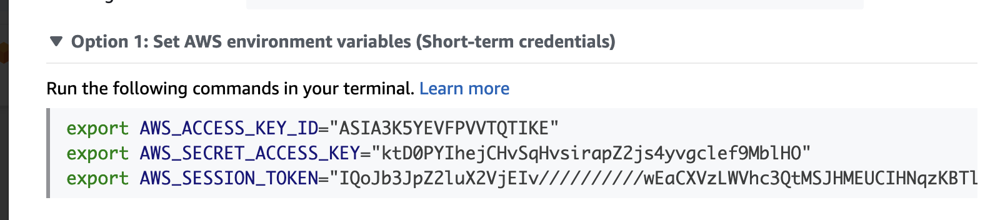
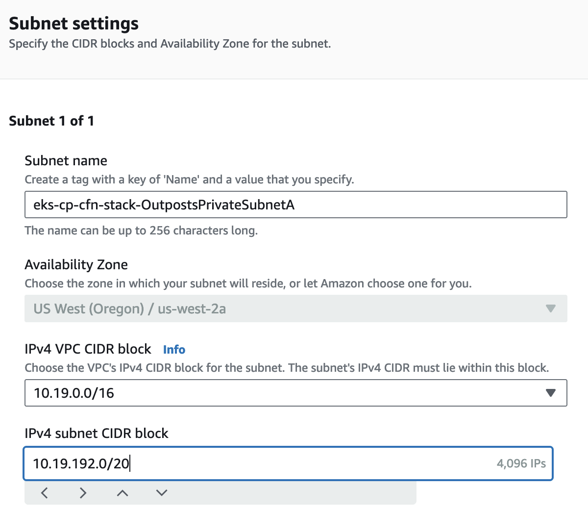
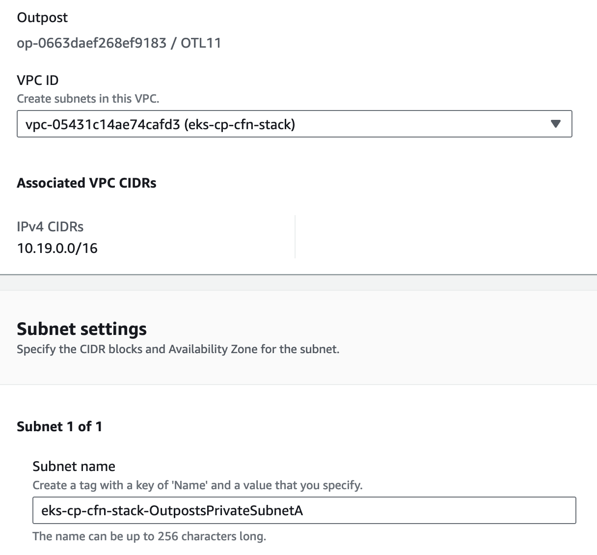

## Amazon EKS on AWS Outposts

You can use Amazon EKS to run on-premises Kubernetes applications on AWS Outposts. You can deploy Amazon EKS on Outposts in the following ways:

- Extended clusters – Run the Kubernetes control plane in an AWS Region and nodes on your Outpost.

- Local clusters – Run the Kubernetes control plane and nodes on your Outpost.

For both deployment options, the Kubernetes control plane is fully managed by AWS. You can use the same Amazon EKS APIs, tools, and console that you use in the cloud to create and run Amazon EKS on Outposts.

The following diagram shows these deployment options:



In this lab, we will extend your Amazon EKS Cluster to Outposts (extended Cluster). 

## Extend Amazon EKS to AWS Outposts

Amazon EKS data plane can be extended to be deployed on AWS Outposts. In this deployment mode the Amazon EKS Kubernetes control plane is deployed in Region but the data plane is extended to the AWS Outposts. With this configuration, you can deploy applications closer to end-users for low-latency performance while maintaining a centralized management plane for your EKS cluster.

To get started, you need to create an Amazon EKS control plane in an AWS Region. You can then add self-managed nodes to the Amazon EKS cluster that are located in the Outposts. These nodes can be used to run Kubernetes pods that are designed to serve requests from users directly from AWS Outposts.

To ensure the pods are highly available, you can use Kubernetes' node affinity and anti-affinity features to ensure that pods are scheduled on Outposts and back up pods are scheduled on nodes in the region. 

By extending Amazon EKS data plane to AWS Outposts, you can take advantage of the low-latency benefits of running your application in proximity to end-users while maintaining a centralized management plane for your EKS control plane.

When you are looking to understand how to design workloads that are stretched across AWS Region and AWS Outposts, this project presents a sample architecture. The project also shares complementary AWS CloudFormation that you can consider to improve operational and developer efficiency.

<br>

> :warning: **Disclaimer:** The sample code; software libraries; command line tools; proofs of concept; templates; or other related technology (including any of the foregoing that are provided by our personnel) is provided to you as AWS Content under the AWS Customer Agreement, or the relevant written agreement between you and AWS (whichever applies). You should not use this AWS Content in your production accounts, or on production or other critical data. You are responsible for testing, securing, and optimizing the AWS Content, such as sample code, as appropriate for production grade use based on your specific quality control practices and standards. Deploying AWS Content may incur AWS charges for creating or using AWS chargeable resources, such as running Amazon EC2 instances or using Amazon S3 storage.

<br> 

## Solution Overview

This solution enables you to simplify and centralize the management of your infrastructure and applications on AWS Region and on AWS Outposts. You can extend the AWS cloud operations experience across hybrid and Local Zones for secure and seamless management, compliance, and observability. AWS Hybrid Cloud Solutions enable you to deliver a consistent AWS experience wherever you need it—from the cloud, to the edge.

To create an EKS cluster with a mix of managed and self-managed nodes, you can use CloudFormation samples to define and deploy the necessary infrastructure. Here's a high-level overview of the solution:

- Define the VPC and Subnets
- Deploy the EKS Cluster
- Add Self-Managed Nodes
- Deploy sample applications in the Region and on Outposts

The following diagram shows the high-level architecture, for running a sample website on AWS Outposts and the Region.

You will be deploying to sample applications one on the Outposts and another backup one in the Region

When you are connecting to the Outposts, the request is served by the [ALB on the Outposts](https://aws.amazon.com/about-aws/global-infrastructure/localzones/features/), and the game (sample application) is hosted by Kubernetes pods, running on the self-managed Amazon EC2 nodes. 

For the backup site in the Region, there is an ALB and Kubernetes pods running on a [managed node group](https://docs.aws.amazon.com/eks/latest/userguide/managed-node-groups.html). The backup game is used for High Availability that makes it easy for IT administrators to set up, operate, and scale in the cloud.


## Amazon EKS Cluster Deployment using AWS Outposts

For the application deployment, we use the combination of CloudFormation YAML files. We use CloudFormation to create AWS resources such as Amazon Virtual Private Cloud (Amazon VPC), Amazon EKS, Amazon EC2, etc. For the application in Kubernetes, we use the YAML manifest files and 2048 game available in this Solution.


>**Note** 
>Important note for developers: All commands mentioned in the instructions were tested using Cloud9 using the Amazon Linux 2 as a platform. If you encounter any issues while working with a different operating system, please verify the applicability of the command to your specific operating system. Some commands may have variations or different syntax depending on the OS in use. Ensure compatibility and make any necessary adjustments before executing the commands on your system. 


### Prerequisites

- Access to Outposts Test LAb (OTL) with IAM account/assume admin role.

- Get familiar with EKS extended to the edge with managed nodes, this is a good [reference](https://github.com/aws-samples/hybrid-eks-cp-localzone?tab=readme-ov-file#extend-amazon-eks-to-aws-local-zones)

## Walk-through


1- Get the user command line exports. via “Command line or programmatic access” via OTL access [link](https://outposts-test-labs.awsapps.com/start#/)



2- Copy the exports 


3- run [prerequisites](https://github.com/aws-samples/hybrid-eks-cp-localzone) “Installation of the latest version AWS Command Line Interface....” step only

4- **skip “To assume role,”** step; skip user/role creation as you already have role assumed, double check through this command


```
aws sts get-caller-identity
```

Results should look like the following

```
{
    "UserId": "AROA3K5YEVFP4RRYTJKY5:anaffa@amazon.ae",
    "Account": "XXX",
    "Arn": "arn:aws:sts::779385874783:_**assumed-role/AWSReservedSSO_AWSAdministratorAccess_**_ed32d420082e67de/anaffa@amazon.ae"
}
```

5- opt in `us-west-2-lax-1a`

6- [walkthrough](https://github.com/aws-samples/hybrid-eks-cp-localzone?tab=readme-ov-file#walkthrough) all steps 

* change DisableIMDSv1 in “eks-selfmanaged-node.yaml” to true by default or add it as additional param [OTL requirement]


7- **Extend EKS cluster to outposts:**

7.1- Create ‘eks-cp-cfn-stack-OutpostsPublicSubnetA’ subnet on outposts with ‘10.19.96.0/20’ and configure the route

7.2- Create ‘eks-cp-cfn-stack-OutpostsPrivateSubnetA’ subnet on outposts with ‘10.19.192.0/20’ and configure the route with nat gateway




7.3- Go through “AWS management Console” https://docs.aws.amazon.com/eks/latest/userguide/eks-outposts-self-managed-nodes.html as the following:


###### Step 1: Launch self-managed Amazon Linux nodes using the AWS Management Console

* Download the latest version of the AWS CloudFormation template.

```
curl -O https://s3.us-west-2.amazonaws.com/amazon-eks/cloudformation/2022-12-23/amazon-eks-nodegroup.yaml

```

* change the subnets and NodeInstanceType parameter

```
aws cloudformation create-stack \
  --stack-name eks-outposts-nodes-cfn-stack \
  --template-body file://amazon-eks-nodegroup.yaml \
  --capabilities CAPABILITY_NAMED_IAM CAPABILITY_AUTO_EXPAND \
  --parameters ParameterKey=ClusterName,ParameterValue=eks-cluster ParameterKey=ClusterControlPlaneSecurityGroup,ParameterValue=$cluster_cp_security_group  ParameterKey=KeyName,ParameterValue=$key_name \
  ParameterKey=Subnets,ParameterValue=[subnet-0a226fe5889e2a6c2](https://us-west-2.console.aws.amazon.com/vpcconsole/home?region=us-west-2#SubnetDetails:subnetId=subnet-0a226fe5889e2a6c2) ParameterKey=VpcId,ParameterValue=$vpc ParameterKey=NodeGroupName,ParameterValue=eks-outposts-selfmanaged-groupnode \
  ParameterKey=DisableIMDSv1,ParameterValue=true \
  ParameterKey=NodeInstanceType,ParameterValue=g4dn.2xlarge \
  ParameterKey=BootstrapArguments,ParameterValue="--kubelet-extra-args --node-labels=game-zone=outpost"
aws cloudformation wait stack-create-complete --stack-name eks-outposts-nodes-cfn-stack
```

###### Step 2: Enable nodes to join your cluster [skip point 1-4 and run the following]

* Map the newly added `rolearn` to the EKS cluster and apply the configuration to Amazon IAM Authenticator configuration map using the following commands. This process may take a few minutes to complete.

```
outposts_node_role=$(aws cloudformation describe-stacks --stack-name "eks-outposts-nodes-cfn-stack" --region "us-west-2" --query 'Stacks[0].Outputs[?OutputKey==`NodeInstanceRole`].OutputValue' --output text)
eksctl create iamidentitymapping --cluster eks-cluster --region=us-west-2 --arn $outposts_node_role --group system:bootstrappers --group system:nodes --username "system:node:{{EC2PrivateDNSName}}"

```

* Verify the Amazon IAM Authenticator configuration map details []

```
kubectl get -n kube-system configmap/aws-auth -o yaml  > aws-auth-cm.yaml 
```

* check nodes as in **point 4**
* continue with gp2 setup as in **point 5 →**  Install the Amazon EBS CSI driver.
* and **point 6** if you are using gpu instances

```
[kubectl apply -f https://raw.githubusercontent.com/NVIDIA/k8s-device-plugin/v0.14.5/nvidia-device-plugin.yml](https://github.com/NVIDIA/k8s-device-plugin/releases/tag/v0.14.5)
```

* Use this deploy 2048 game on outposts [2048_op.yaml](https://quip-amazon.com/-/blob/THD9AAIGfzI/UHfXivzxdpGRsD8nJl9WxQ?name=2048_op.yaml&s=s1XCAddkd6OZ) after updating the subnet.

```
 kubectl apply -f 2048_op.yaml
```


## Clean up
1- Cleanup resources on Outposts

```
kubectl delete -f 2048_backup.yaml
kubectl delete -f 2048_lz.yaml
kubectl delete -f 2048_op.yaml
kubectl delete -f https://raw.githubusercontent.com/NVIDIA/k8s-device-plugin/v0.14.5/nvidia-device-plugin.yml
helm delete aws-load-balancer-controller -n kube-system

aws cloudformation delete-stack --stack-name eksctl-eks-cluster-addon-iamserviceaccount-kube-system-aws-load-balancer-controller
aws cloudformation wait stack-delete-complete --stack-name eksctl-eks-cluster-addon-iamserviceaccount-kube-system-aws-load-balancer-controller

aws cloudformation delete-stack --stack-name eks-outposts-nodes-cfn-stack
aws cloudformation wait stack-delete-complete --stack-name eks-outposts-nodes-cfn-stack

aws cloudformation delete-stack --stack-name eks-lz-nodes-cfn-stack
aws cloudformation wait stack-delete-complete --stack-name eks-lz-nodes-cfn-stack

aws cloudformation delete-stack --stack-name eks-cp-cfn-stack
aws cloudformation wait stack-delete-complete --stack-name eks-cp-cfn-stack
```
2- Cleanup other resources [README.md](../README.md)

## Conclusion 

Extending an Amazon EKS cluster to AWS Outposts offers many benefits for organizations looking to improve the performance, availability, and resiliency of their containerized applications. With this configurations, you can leverage the low-latency access to compute and storage resources in geographically closer locations to your end-users or data sources.

In this solution, we have covered the essential steps to extend an Amazon EKS cluster to Local Zones, this includes setting up Amazon EKS cluster, launching self-managed node in the Local Zone, joining the node in the Local Zone to the EKS cluster and deploying a sample application.

By following these steps, you leveraged an Amazon EKS cluster that is highly available, fault-tolerant, and scalable while maintaining a centralized control plane. With this infrastructure, you can easily deploy and manage containerized applications in multiple locations, improving the user experience and reducing the risk of downtime.

## Security

See [CONTRIBUTING](CONTRIBUTING.md#security-issue-notifications) for more information.

## License

This library is licensed under the MIT-0 License. See the LICENSE file.

